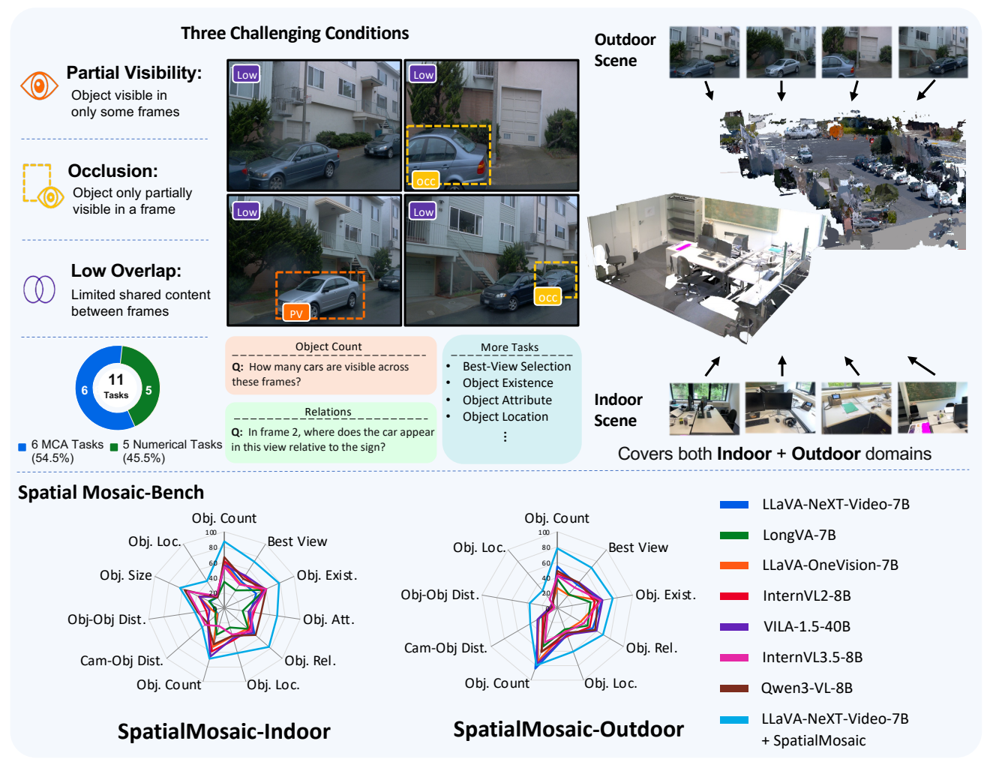
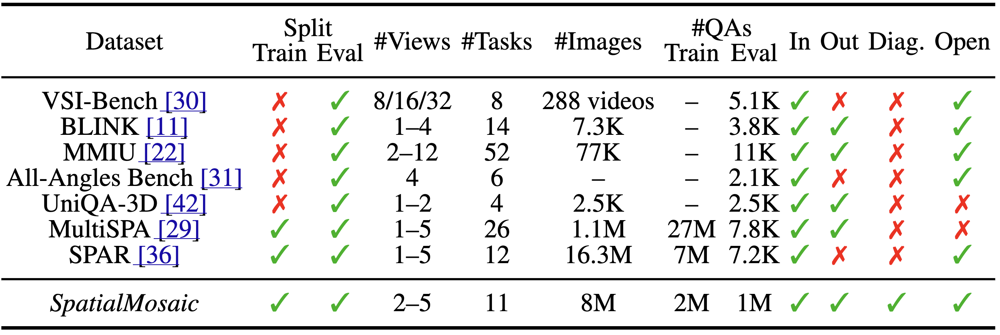
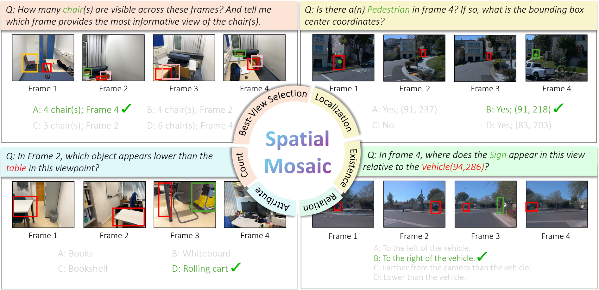

<h1 align="center">SpatialMosaic: A Multi-View VLM Dataset for<br>Partial Visibility</h1>

<p align="center">
  Kanghee Lee<sup>1</sup>, Injae Lee<sup>1</sup>, Minseok Kwak<sup>2</sup>, Jungi Hong<sup>1</sup>, Sion Lee<sup>3</sup>,<br>
  Kwonyoung Ryu<sup>4</sup>, and Jaesik Park<sup>1</sup><br>
  <sup>1</sup>Seoul National University &nbsp;&nbsp; <sup>2</sup>University College London<br>
  <sup>3</sup>Kyung Hee University &nbsp;&nbsp; <sup>4</sup>POSTECH
</p>

<p align="center">
  <a href="https://kanghee-lee.github.io/spatialmosaic/"></a>
  <a href="https://arxiv.org/abs/2512.23365"></a>
  <a href="https://huggingface.co/datasets/anonymoussubmmision/spatial_mosaic_vqa"></a>
</p>

<p align="center">
  
</p>

SpatialMosaic is a multi-view VQA dataset for spatial reasoning under three
challenging conditions: partial visibility, occlusion, and low-overlap views.
It covers both indoor and outdoor scenes, pairing ScanNet++ and Waymo imagery
with questions that require reasoning across fragmented observations.

This repository contains training and evaluation code for Spatial Mosaic.

Use `/spatial_mosaic` below as the repository root.

## Contents

- [SpatialMosaic](#spatialmosaic)
  - [VQA Summary](#vqa-summary)
  - [Task Types](#task-types)
  - [Data Format and Examples](#data-format-and-examples)
  - [Download](#download)
  - [Train](#train)
- [SpatialMosaic-Bench](#spatialmosaic-bench)
  - [Eval](#eval)

## SpatialMosaic

### VQA Summary

<p align="center">
  
</p>

SpatialMosaic evaluates multi-view VQA under partial visibility, where models
must combine evidence from 2-5 views because the target objects or relations may
be occluded, visible only from certain views, or split across low-overlap
observations. The dataset covers indoor and outdoor scenes and asks questions
about object counting, object presence and localization, best-view selection,
object-object spatial relations, and view-specific position reasoning.

### Task Types

<p align="center">
  
</p>

Spatial Mosaic includes multi-view VQA tasks designed for partial visibility,
occlusion, and low-overlap observations. The task examples below cover
representative reasoning patterns such as cross-view object counting and
best-view selection, object presence and localization, object-object spatial
relations, and view-specific position comparison.


### Data Format and Examples

The train and test splits use different JSON layouts. Training samples are
stored in a conversation format for VLM instruction tuning, while test samples
are flattened into question, option, answer, and evaluation metadata fields for
benchmarking.

Each training QA sample consists of:

```json
{
  "id": "97c9a5ce-f377-4029-9e14-d54181cd5e2e",
  "data_source": "scannetpp",
  "scene_name": "35f2120068",
  "question_type": "obj_spatial_occ_fb",
  "frames": [
    "frame_009770",
    "frame_007960",
    "frame_008450",
    "frame_003460",
    "frame_008240"
  ],
  "conversations": [
    {
      "from": "human",
      "value": "<image>\nThese are frames of a video.\n\nIn frame_009770, where does the heater appear in this view relative to the cardboard box(217,122)?\n\nOptions:\nA. Lower than the cardboard box.\nB. Farther from the camera than the cardboard box.\nC. To the left of the cardboard box.\nD. Closer to the camera than the cardboard box.\nAnswer with the option's letter from the given choices directly."
    },
    {
      "from": "gpt",
      "value": "D"
    }
  ]
}
```

Each test QA sample consists of:

```json
{
  "dataset": "scannetpp",
  "scene_name": "2ab7bea148",
  "question_type": "obj_count_occ_na",
  "frames": [
    "frame_009170",
    "frame_016110",
    "frame_001790",
    "frame_016000",
    "frame_007270"
  ],
  "question": "How many mouse(s) are visible across these frames?",
  "options": [
    "A. 4",
    "B. 3",
    "C. 2",
    "D. 1"
  ],
  "ground_truth": "1",
  "mc_answer": "D",
  "overlap_avg": 3.9537576000000003,
  "occlusion_avg": 0.0,
  "occ_level": "low",
  "overlap_level": "high",
  "vis_level": "Fully Visible",
  "GT Scenario": "Full Coverage",
  "id": 0,
  "bbox_2d": [],
  "bbox_2d_diag": "0"
}
```

Here, `frames` contains the image IDs used by each QA sample. The corresponding
images should be placed under
`spatial_mosaic_dataset/{scannetpp|waymo}/{scene_name}/images/`. Some test
metadata fields can vary by source; for example, indoor samples may include
`ground_truth`, `bbox_2d`, and `bbox_2d_diag` when available.

### Download

We provide two scene sources for Spatial Mosaic:

| Dataset | Description | Example Path |
| --- | --- | --- |
| `scannetpp` | Indoor multi-view scene images. | `spatial_mosaic_dataset/scannetpp/{scene_id}/images/` |
| `waymo` | Outdoor driving multi-view scene images. | `spatial_mosaic_dataset/waymo/{scene_id}/images/` |

Here, `{scene_id}` denotes each actual scene folder name, such as `0a5c013435`.

The Hugging Face dataset linked below provides only the Spatial Mosaic VQA
annotations. It does not redistribute the original ScanNet++ or Waymo scene
images. Download the image data from the official dataset sources and follow
their access requirements, licenses, terms of use, citation rules, and privacy
requirements.

The VQA annotation license does not grant any rights to redistribute or use the
underlying ScanNet++ or Waymo images outside their original dataset terms.

Our dataset directory structure is:

```text
spatial_mosaic_dataset/
├── scannetpp/
│   └── {scene_id}/
│       └── images/
├── waymo/
│   └── {scene_id}/
│       └── images/
└── spatial_mosaic_vqa/
    ├── train/
    └── test/
```

The Spatial Mosaic VQA annotations are hosted on Hugging Face:
https://huggingface.co/datasets/anonymoussubmmision/spatial_mosaic_vqa

This archive contains the VQA JSON annotations only; follow the license and
usage terms listed on the Hugging Face dataset card. Install or update the
Hugging Face CLI, then download and extract the VQA archive under the dataset
root:

```bash
cd spatial_mosaic
python -m pip install -U huggingface_hub

mkdir -p spatial_mosaic_dataset
hf download anonymoussubmmision/spatial_mosaic_vqa \
  spatial_mosaic_vqa.tar.gz SHA256SUMS \
  --repo-type dataset \
  --local-dir spatial_mosaic_dataset

cd spatial_mosaic_dataset
sha256sum -c SHA256SUMS
tar -xzf spatial_mosaic_vqa.tar.gz
```

After extraction, the VQA JSON files should be available under
`spatial_mosaic_dataset/spatial_mosaic_vqa/train/` and
`spatial_mosaic_dataset/spatial_mosaic_vqa/test/`.

### Train

#### Environmental Setup

Create and activate the training environment:

```bash
cd spatial_mosaic
conda env create -f scripts/environment.yaml
conda activate spatial_mosaic
```

Install VGGT from the vendored source:

```bash
cd spatial_mosaic
cd vggt
pip install -e .
cd ..
```

Set `PYTHONPATH` from both the spatial_mosaic root and the `llava` directory:

```bash
PYTHONPATH=$(pwd):$PYTHONPATH
cd llava
PYTHONPATH=$(pwd):$PYTHONPATH
cd ..
```

#### How To Train

Training scripts are provided for both indoor and outdoor scenes, with standard
and VGGT variants. The example below shows indoor LLaVA-NeXT training.

Before launching training, update the indoor config and script with your data
paths:

- `scripts/model/spatial_mosaic/indoor/indoor.yaml`
- `scripts/model/spatial_mosaic/indoor/train_llavanext.sh`

In `train_llavanext.sh`, set the required paths such as `FRAME_FOLDER`,
`IMAGE_FOLDER`, and `VIDEO_FOLDER`.

Then run training from the spatial_mosaic root:

```bash
CUDA_VISIBLE_DEVICES=2,3 NUM_GPUS_PER_NODE=2 bash scripts/model/spatial_mosaic/indoor/train_llavanext.sh
```

## SpatialMosaic-Bench

### Eval

#### Environmental Setup

Create the evaluation environment:

```bash
cd spatial_mosaic
conda env create -f thinking-in-space/spatial_mosaic/environment.yaml
conda activate vsibench
```

#### How To Eval

Evaluation scripts are provided for both indoor and outdoor scenes, with
standard and VGGT variants. The example below shows indoor LLaVA-NeXT
evaluation.

Before launching evaluation, update the indoor evaluation script and task files
with your checkpoint and data paths:

- `/spatial_mosaic/thinking-in-space/spatial_mosaic/indoor/eval_llavanext.sh`
  Set `pretrained` to your checkpoint path. To evaluate the open-source
  LLaVA-NeXT-Video model, set `pretrained` to
  `lmms-lab/LLaVA-NeXT-Video-7B-Qwen2`.
- `/spatial_mosaic/thinking-in-space/lmms_eval/tasks/spatial_mosaic/indoor/indoor.yaml`
  Set the VQA data path.
- `/spatial_mosaic/thinking-in-space/lmms_eval/tasks/spatial_mosaic/indoor/utils.py`
  Set `FRAMES_ROOT = "path_to_img"`.

Then run evaluation from the indoor evaluation directory:

```bash
cd thinking-in-space/spatial_mosaic/indoor
bash eval_llavanext.sh
```
